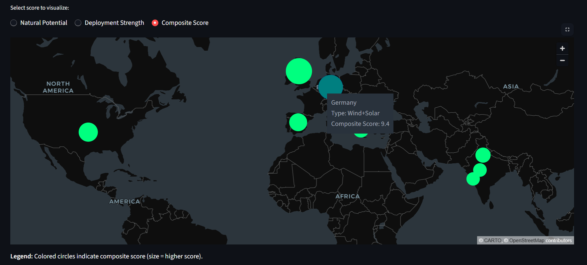

# Renewable Energy Dashboard

An interactive data dashboard built using Python and Streamlit to visualize and analyze renewable energy metrics.

## Overview
This dashboard aggregates and presents renewable energy data through interactive charts and visualizations. It is designed to support comparative analysis of renewable energy performance, with a focus on wind and solar energy indicators.

## Features
- Interactive data visualization
- Renewable energy performance comparison
- Dynamic charts and tables
- User-friendly web interface

## Spatial Analysis
The dashboard includes a map-based visualization to represent regional renewable energy characteristics.

- Circles indicate renewable resource availability across different regions
- Additional markers represent supporting energy infrastructure
- Circle size reflects a composite score derived from multiple parameters

This visualization supports comparative regional analysis and helps identify areas with higher renewable energy potential.

## Example Visualization

## Technologies Used
- Python
- Streamlit
- Pandas
- Plotly / Matplotlib

## Use Case
The dashboard is suitable for:
- Renewable energy data analysis
- Academic demonstrations
- Visual exploration of energy trends

## Notes
This project emphasizes clarity, usability, and applied data analysis rather than real-time or industrial-scale deployment.

## Live Demo
The application can be accessed here:
https://renewable-energy-dashboard-tyjnk5t6zxjxbklgs7vgbp.streamlit.app/

